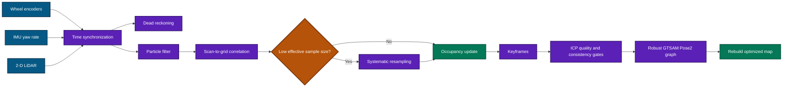
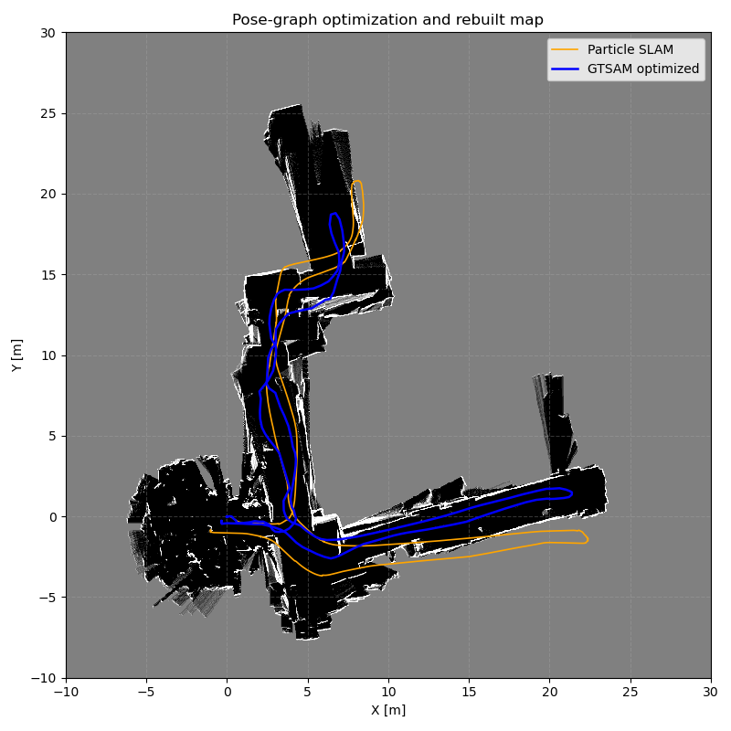
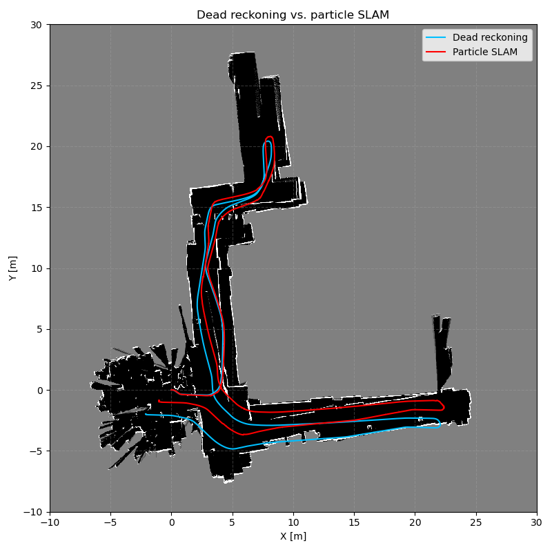
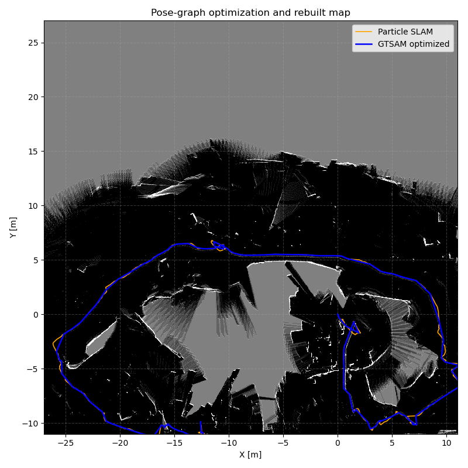

# particleSLAM

A reproducible 2-D particle-filter SLAM pipeline for differential-drive and planar holonomic robots. It synchronizes wheel odometry, IMU, and LiDAR; produces a dead-reckoning baseline; builds an occupancy grid; and refines the particle-filter trajectory with robust ICP-gated GTSAM optimization.

> [!NOTE]
> The LiDAR SLAM workflow is implemented end to end. See [PROJECT_REPORT.md](PROJECT_REPORT.md) for consolidated status and results. Private assignment documents are neither included nor linked.

## Pipeline



## Reproduced results

Both complete runs used the CPU backend, 100 particles, seed 42, 20-scan keyframes, and the default robust graph settings.

| Metric | Dataset 20 | Dataset 21 |
| --- | ---: | ---: |
| Particle-filter poses | 4,961 | 4,784 |
| GTSAM keyframes | 249 | 241 |
| Accepted / candidate ICP constraints | 23 / 54 | 37 / 54 |
| PF path / optimized path | 97.38 / 95.16 m | 95.53 / 90.92 m |
| Mean / maximum pose shift | 0.49 / 0.81 m | 0.48 / 1.07 m |
| Mean loop residual, before / after | 0.072 / 0.016 | 0.023 / 0.006 |
| Rebuilt observed grid cells | 110,017 | 103,081 |



The stricter policy corrected an earlier over-constrained result. Fixed candidates are sampled once per interval, proximity candidates are bounded, ICP must pass overlap, RMSE, translation, and yaw gates, and accepted factors use a Huber loss.

A three-policy sensitivity study on each dataset changed the candidate pool from 39 to 69 while optimized path length varied by at most 0.03 m per dataset. The detailed six-run table is in [PROJECT_REPORT.md](PROJECT_REPORT.md).

> [!IMPORTANT]
> These are internal-consistency measurements, not absolute-error claims. The datasets contain no ground-truth trajectory. Texture mapping also cannot be produced because no synchronized RGB/RGB-D frames or camera calibration are present.



### MIT Stata Center extension

Eight real PR2 recordings were downloaded and converted with the `mit-stata` profile. All bags expose the same 1,040-beam base LiDAR schema. The importer retains forward and lateral odometry increments for the PR2's holonomic base, applies the measured 0.275 m base-to-LiDAR offset, and derives map bounds from each run.

| Recording | Size | Duration | LiDAR scans |
| --- | ---: | ---: | ---: |
| `2011-01-24-06-18-27` | 0.242 GB | 224.5 s | 4,489 |
| `2011-01-25-06-29-26` | 0.339 GB | 247.7 s | 4,951 |
| `2011-04-06-07-04-17` | 0.349 GB | 324.2 s | 6,495 |
| `2011-04-22-06-22-12` | 0.534 GB | 1,199.5 s | 23,987 |
| `2011-04-11-07-34-27` | 0.596 GB | 1,185.2 s | 23,653 |
| `2011-04-15-06-16-49` | 0.606 GB | 1,191.1 s | 23,761 |
| `2011-04-22-06-52-29` | 0.638 GB | 1,435.7 s | 28,779 |
| `2011-04-29-06-16-08` | 0.781 GB | 1,562.0 s | 31,216 |

The smallest recording was run end to end with the CPU backend, 100 particles, seed 42, and 20-scan keyframes:

| Validation result | Value |
| --- | ---: |
| Published / reconstructed odometry distance | 87.00 / 87.01 m |
| Particle-filter poses / GTSAM keyframes | 4,488 / 226 |
| Accepted / candidate ICP constraints | 1 / 52 |
| Particle / optimized path measurement | 144.44 / 116.68 m |
| Loop residual before / after | 0.159 / 0.029 |
| Rebuilt observed grid cells | 331,739 |



> [!WARNING]
> The 87.01 m odometry reconstruction validates the imported holonomic controls. The particle and optimized path measurements are not accuracy results: repeated local scan-correlation offsets introduce accumulated pose jitter, inflating path length, and only one loop factor passed the current gates. The other seven bags are converted but intentionally not run at full quality until the Stata-specific proposal/correlation settings are tuned.

## Features

- Encoder-aware differential-drive and planar holonomic odometry with filtered IMU yaw rate
- LiDAR-time synchronization and explicit IMU-tail warning
- NumPy CPU and optional CuPy GPU particle filters
- Scan-to-grid correlation, log-odds mapping, and Bresenham ray tracing
- Systematic resampling and per-update diagnostics
- Dead-reckoning comparison mode
- SE(2)-correct keyframe graph and 2-D ICP validation
- Robust GTSAM factors and optimized-map reconstruction
- JSON, Markdown, image, and NPZ artifacts
- Reusable graph parameter study for both datasets

## Repository layout

```text
particleSLAM/
|-- code/
|   |-- main.py                 # End-to-end CLI
|   |-- config.py               # Typed algorithm configuration
|   |-- dataset_utils.py        # Loading and synchronization
|   |-- dead_reckoning.py       # Deterministic baseline
|   |-- particle_filter_cpu.py  # NumPy particle filter
|   |-- particle_filter_gpu.py  # Optional CuPy backend
|   |-- pose_graph.py           # ICP and robust GTSAM optimization
|   |-- optimize_result.py      # Re-optimize a saved PF result
|   `-- parameter_study.py      # Compare graph settings
|-- data/                       # Encoder, IMU, and LiDAR datasets
|-- tests/                      # Automated tests
|-- assets/                     # Curated README images
`-- PROJECT_REPORT.md           # Consolidated implementation report
```

External MIT Stata Center and uHumans2 ROS bags are supported through `code/import_rosbag.py`; see [EXTERNAL_DATASETS.md](EXTERNAL_DATASETS.md). The bags themselves remain outside Git.

## Installation

Python 3.10 is recommended. For a lightweight CPU environment:

```bash
python -m venv .venv
source .venv/bin/activate  # Windows PowerShell: .venv\Scripts\Activate.ps1
python -m pip install numpy matplotlib tqdm scipy gtsam
```

The checked-in `requirments.txt` is a Linux Conda explicit package list (the filename is retained for compatibility):

```bash
conda create --name particle-slam --file requirments.txt
conda activate particle-slam
python -m pip install scipy gtsam
```

CuPy and compatible CUDA are required only for `--backend gpu`.

## Run

Run from the repository root:

```bash
# Default dataset 20 run
python code/main.py

# Complete comparison and robust optimization
python code/main.py --dataset 20 --mode compare --backend cpu --particles 100 --seed 42 --skip-reference-map --optimize --keyframe-interval 20 --output-dir build/final20

# Dataset 21 with the same configuration
python code/main.py --dataset 21 --mode compare --backend cpu --particles 100 --seed 42 --skip-reference-map --optimize --keyframe-interval 20 --output-dir build/final21

# Retune without rerunning the particle filter
python code/optimize_result.py --synced-data build/final20/synced_data_20.npz --particle-result build/final20/particle_slam_20_cpu.npz --output-dir build/retuned

# Compare graph settings on both datasets
python code/parameter_study.py --dataset 20 --input-dir build/final20 --dataset 21 --input-dir build/final21

python code/main.py --help
```

To run an imported ROS bag conversion, pass its canonical NPZ through `--synced-input`. This avoids pretending that third-party datasets use the original numbered three-file format.

Use `--max-steps` for a short diagnostic run, `--data-dir` for another input directory, and `--output-dir` to isolate generated artifacts.

## Dataset notes

The repository includes runs `20` and `21`, each with matching encoder, Hokuyo LiDAR, and IMU archives. Dataset 20 is about 4.2 seconds and 4.1 odometry meters longer; dataset 21 follows a different route and has a higher peak yaw rate.

| Raw-data metric | Dataset 20 | Dataset 21 |
| --- | ---: | ---: |
| Recording duration | 123.6 s | 119.4 s |
| Encoder samples | 4,956 | 4,789 |
| LiDAR scans | 4,962 | 4,785 |
| IMU samples | 12,187 | 11,730 |
| Wheel-odometry path | 96.60 m | 92.47 m |
| Mean valid LiDAR range | 2.37 m | 2.56 m |
| Maximum absolute yaw rate | 1.54 rad/s | 1.89 rad/s |

> [!CAUTION]
> The IMU ends roughly 1.7-2.0 seconds before encoder and LiDAR. Synchronization holds the final IMU sample over that tail. Strict evaluations should crop to the common interval or exclude extrapolated samples.

## Outputs and configuration

Generated files under `build/` include synchronized data, trajectories, occupancy grids, diagnostics, comparison figures, optimized results, evaluation JSON, and a Markdown run report.

Runtime choices are CLI flags. Algorithm defaults live in `code/config.py`: `MapConfig`, `RobotConfig`, `LidarConfig`, `ParticleFilterConfig`, and `PoseGraphConfig`.

## Project status

The planned LiDAR SLAM workflow is complete and tested across both supplied datasets. Remaining evaluations require absent external data: an aligned ground-truth trajectory for absolute error, and calibrated synchronized camera frames for texture mapping.

## Contributor

- Hyungjun Doh
