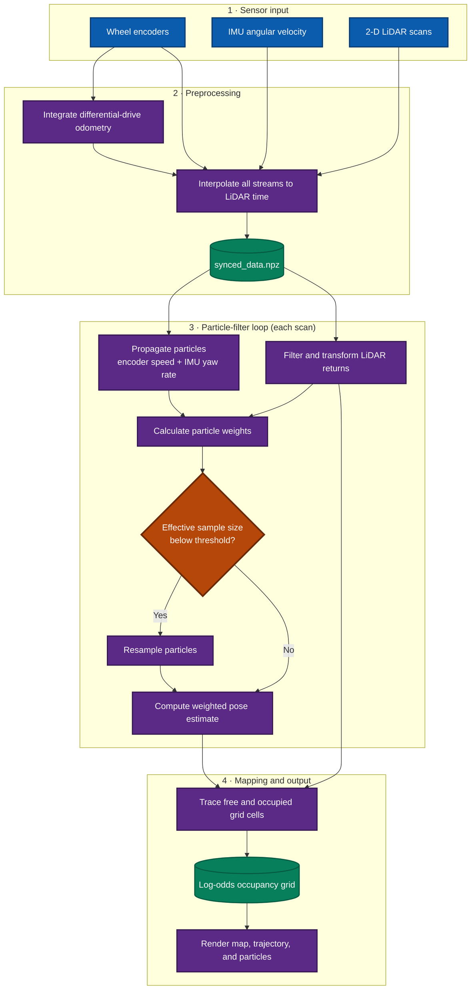

# particleSLAM

A Python implementation of 2-D particle-filter SLAM for a differential-drive robot. The pipeline synchronizes wheel-encoder, IMU, and LiDAR measurements; integrates odometry; traces LiDAR rays into a log-odds occupancy grid; and estimates the robot trajectory with a particle filter.

> [!NOTE]
> This repository is an experimental project. The current CPU and GPU measurement-update functions use placeholder random scores rather than map-correlation likelihoods, so the output should not be treated as a production-quality SLAM estimate.

## Pipeline



## Features

- Differential-drive odometry from wheel encoders
- Sensor interpolation onto LiDAR timestamps
- Configurable robot, LiDAR, and map geometry
- Log-odds occupancy-grid mapping with Bresenham ray tracing
- NumPy CPU and optional CuPy GPU particle-filter backends
- Map, trajectory, and particle visualization in metric coordinates

## Repository layout

```text
particleSLAM/
├── code/
│   ├── main.py                 # Default end-to-end entry point
│   ├── config.py               # Robot, LiDAR, and map parameters
│   ├── dataset_utils.py        # Loading and time synchronization
│   ├── odom.py                 # Odometry and ray-tracing utilities
│   ├── occupancy_grid.py       # Occupancy-grid construction and updates
│   ├── particle_filter_cpu.py  # NumPy particle-filter backend
│   ├── particle_filter_gpu.py  # CuPy particle-filter backend
│   └── visualize.py            # Result rendering
├── data/                       # Encoder, IMU, and LiDAR datasets
├── plots/                      # Generated examples and snapshots
└── requirments.txt             # Linux Conda environment specification
```

## Requirements

- Python 3.10 (matching the supplied environment specification)
- NumPy
- Matplotlib with a Tk-compatible GUI backend
- tqdm
- CuPy with a compatible CUDA installation, only for the GPU backend

The checked-in `requirments.txt` is a Linux `conda` explicit package list, despite its filename. To reproduce that environment:

```bash
conda create --name particle-slam --file requirments.txt
conda activate particle-slam
```

For a lightweight CPU-only environment:

```bash
python -m venv .venv
source .venv/bin/activate  # Windows PowerShell: .venv\Scripts\Activate.ps1
python -m pip install numpy matplotlib tqdm
```

## Dataset

The default run selects dataset `20` in `code/main.py` and expects these files in `data/`:

```text
Encoders20.npz
Hokuyo20.npz
Imu20.npz
```

To use another numbered dataset, add the matching three files and change the `dataset` value in `code/main.py`. Array keys and shapes must match those read by `code/dataset_utils.py`.

## Run

Run from the `code` directory because input and output paths are relative to it:

```bash
cd code
python main.py
```

The default entry point:

1. Loads dataset 20.
2. Synchronizes encoder and IMU measurements to LiDAR timestamps.
3. Builds and saves an occupancy grid.
4. Runs the 1,000-particle CPU backend.
5. Saves the final map, estimated trajectory, and particles as an image.

To use the GPU backend, install a CUDA-compatible CuPy build and switch the final call in `code/main.py` from `particle_filter_cpu(NUM_PARTICLES)` to `particle_filter_gpu(NUM_PARTICLES)`.

## Outputs

Files are written to the current working directory (normally `code/`):

| Artifact | Description |
| --- | --- |
| `synced_data.npz` | LiDAR-time-aligned sensor data and odometry pose |
| `ogm_grid.npz` | Occupancy-grid values and map configuration |
| `pf_grid_cells_####.png` | Final occupancy map with trajectory and particle cloud |

## Configuration

Edit `code/config.py` to adjust:

- Map resolution and bounds (`MapConfig`)
- Wheel geometry and encoder resolution (`RobotConfig`)
- LiDAR mounting pose and valid range (`LidarConfig`)

The defaults create a 5 cm-resolution map spanning -10 m to 30 m on both axes and use LiDAR returns from 0.05 m to 30 m.

## Project status

The data synchronization, motion propagation, occupancy-grid updates, resampling, and CPU/GPU execution paths are implemented. A scan-to-map likelihood model is still needed in `measurement_update_cpu` and `measurement_update_gpu` to replace placeholder random particle weights.

## Contributor

- Hyungjun Doh
