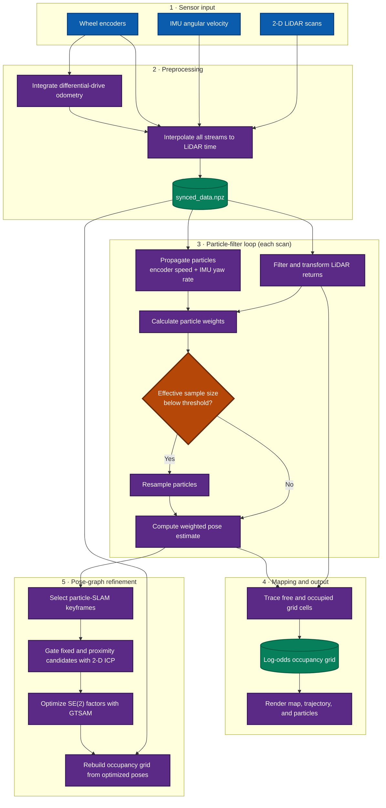
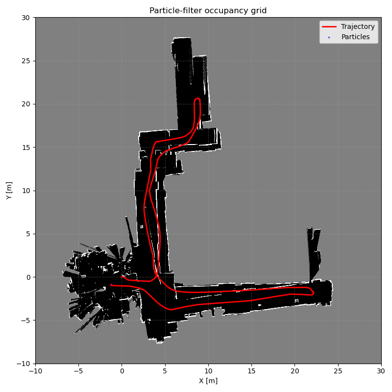

# particleSLAM

A Python implementation of 2-D particle-filter SLAM for a differential-drive robot. The pipeline synchronizes wheel-encoder, IMU, and LiDAR measurements; integrates odometry; traces LiDAR rays into a log-odds occupancy grid; and estimates the robot trajectory with a particle filter.

> [!NOTE]
> This repository is an experimental project. Dead reckoning, CPU/GPU particle SLAM, ICP-gated GTSAM pose-graph optimization, optimized-map reconstruction, diagnostics, and evaluation are implemented. The current fixed-interval ICP policy remains intentionally visible as preliminary work because it over-constrains the full dataset 20 trajectory.

## Pipeline



## Demo result

The following result was generated from the complete dataset 20 sequence with the CPU backend, 100 particles, and random seed 42. The run processed 4,961 filter updates in approximately 2 minutes 49 seconds on the development machine.

```bash
python code/main.py \
  --dataset 20 \
  --backend cpu \
  --particles 100 \
  --seed 42 \
  --skip-reference-map \
  --output-dir build/demo
```



| Result | Value |
| --- | ---: |
| Filter updates | 4,961 |
| Estimated path length | 97.50 m |
| Final pose \((x, y, \theta)\) | \((-1.19\text{ m}, -0.89\text{ m}, 0.026\text{ rad})\) |
| Observed grid cells | 109,167 |
| Occupied grid cells | 7,926 |
| Free grid cells | 101,241 |

This is an experimental particle-filter result, not a ground-truth accuracy claim. The remaining trajectory and map distortion motivate the planned factor-graph and loop-closure stages.

### Experimental pose-graph result

The complete optimization workflow can be reproduced with:

```bash
python code/main.py \
  --dataset 20 \
  --mode compare \
  --backend cpu \
  --particles 100 \
  --seed 42 \
  --skip-reference-map \
  --optimize \
  --keyframe-interval 20 \
  --output-dir build/final20
```


| Optimization result | Value |
| --- | ---: |
| PF poses / GTSAM keyframes | 4,961 / 249 |
| Accepted ICP constraints | 251 |
| Mean loop residual, before / after | 0.429 / 0.185 |
| PF path / optimized path | 97.38 m / 92.21 m |
| Mean / maximum pose shift | 1.35 m / 3.10 m |
| Rebuilt observed grid cells | 112,440 |

> [!WARNING]
> This result proves the full optimization and map-reconstruction path runs, but it is not yet a final accuracy result. The high number of accepted fixed-interval constraints visibly bends the north and east corridors. Future tuning should separate local scan factors from true loop closures and tighten ICP acceptance using consistency checks or robust noise models.

The deterministic baseline and particle-filter comparison from the same run is shown below.


## Features

- Differential-drive odometry from wheel encoders
- Sensor interpolation onto LiDAR timestamps
- Configurable robot, LiDAR, and map geometry
- Log-odds occupancy-grid mapping with Bresenham ray tracing
- NumPy CPU and optional CuPy GPU particle-filter backends
- Map, trajectory, and particle visualization in metric coordinates
- Deterministic dead-reckoning baseline and comparison mode
- Systematic resampling and per-update filter diagnostics
- SE(2)-correct GTSAM keyframe graph
- Fixed-interval and proximity loop candidates validated with 2-D ICP
- Optimized occupancy-map reconstruction and JSON/Markdown evaluation reports

## Repository layout

```text
particleSLAM/
├── code/
│   ├── main.py                 # Default end-to-end entry point
│   ├── config.py               # Robot, LiDAR, and map parameters
│   ├── dataset_utils.py        # Loading and time synchronization
│   ├── odom.py                 # Odometry and ray-tracing utilities
│   ├── occupancy_grid.py       # Occupancy-grid construction and updates
│   ├── dead_reckoning.py       # Deterministic odometry baseline
│   ├── particle_filter_cpu.py  # NumPy particle-filter backend
│   ├── particle_filter_gpu.py  # CuPy particle-filter backend
│   ├── pose_graph.py           # ICP and GTSAM pose-graph optimization
│   ├── evaluation.py           # Metrics and run-report generation
│   └── visualize.py            # Result rendering
├── data/                       # Encoder, IMU, and LiDAR datasets
├── plots/                      # Generated examples and snapshots
└── requirments.txt             # Linux Conda environment specification
```

## Requirements

- Python 3.10 (matching the supplied environment specification)
- NumPy
- Matplotlib with a Tk-compatible GUI backend
- tqdm
- SciPy
- GTSAM, for pose-graph optimization
- CuPy with a compatible CUDA installation, only for the GPU backend

The checked-in `requirments.txt` is a Linux `conda` explicit package list, despite its filename. To reproduce that environment:

```bash
conda create --name particle-slam --file requirments.txt
conda activate particle-slam
python -m pip install scipy gtsam
```

For a lightweight CPU-only environment:

```bash
python -m venv .venv
source .venv/bin/activate  # Windows PowerShell: .venv\Scripts\Activate.ps1
python -m pip install numpy matplotlib tqdm scipy gtsam
```

## Dataset

The repository includes two separate robot runs, datasets `20` and `21`. The default CLI selection is dataset `20`. Each run consists of matching encoder, LiDAR, and IMU archives in `data/`:

```text
Encoders20.npz
Hokuyo20.npz
Imu20.npz
```

Select dataset 21 without modifying the source:

```bash
python code/main.py --dataset 21
```

### Dataset comparison

| Metric | Dataset 20 | Dataset 21 |
| --- | ---: | ---: |
| Recording duration | 123.6 s | 119.4 s |
| Encoder samples | 4,956 | 4,789 |
| LiDAR scans | 4,962 | 4,785 |
| IMU samples | 12,187 | 11,730 |
| Encoder/LiDAR rate | ~40 Hz | ~40 Hz |
| IMU rate | ~100 Hz | ~100 Hz |
| Wheel-odometry path length | 96.60 m | 92.47 m |
| Final odometry position | (2.60, 9.66) m | (17.28, 5.75) m |
| Final odometry heading | 0.169 rad | -0.055 rad |
| Mean valid LiDAR range | 2.37 m | 2.56 m |
| Maximum absolute yaw rate | 1.54 rad/s | 1.89 rad/s |

Dataset 20 is approximately 4.2 seconds and 4.1 meters longer. Dataset 21 follows a different route, finishes farther along the positive X axis, contains a slightly larger peak yaw rate, and has marginally longer LiDAR returns on average. Both runs use effectively identical sensor frequencies and have more than 99.6% valid LiDAR returns, so they can share the same initial processing configuration.

> [!CAUTION]
> In both runs, the IMU recording ends roughly 1.7-2.0 seconds before the encoder and LiDAR streams. Synchronization currently holds the final IMU sample across this tail. For strict evaluation, crop all streams to their common time interval or explicitly exclude extrapolated samples.

To add another numbered dataset, provide the matching `Encoders`, `Hokuyo`, and `Imu` archives. Array keys and shapes must match those validated by `code/dataset_utils.py`.

## Run

Run the pipeline from the repository root:

```bash
python code/main.py
```

The default entry point:

1. Loads dataset 20.
2. Synchronizes encoder and IMU measurements to LiDAR timestamps.
3. Builds and saves an occupancy grid.
4. Runs the 1,000-particle CPU backend.
5. Saves the final map, estimated trajectory, and particles as an image.

Runtime choices are command-line options rather than source-code flags:

```bash
# Select another dataset and particle count
python code/main.py --dataset 21 --particles 500

# Generate dead-reckoning and particle-SLAM comparison artifacts
python code/main.py --mode compare --dataset 20 --particles 100

# Run a short diagnostic slice
python code/main.py --mode compare --max-steps 500 --particles 25

# Use the optional CuPy backend
python code/main.py --backend gpu

# Run ICP loop closures, GTSAM optimization, and optimized-map reconstruction
python code/main.py --mode compare --particles 100 --optimize

# List every option
python code/main.py --help
```

Use `--data-dir` and `--output-dir` to override the default `data/` and `build/` directories. Use `--skip-reference-map` when only the selected estimator output is needed. Every SLAM run also saves a diagnostic history and plot containing effective sample size, maximum particle weight, valid scan count, resampling events, and particle spread.

## Outputs

Files are written to `build/` by default and include the dataset number and backend where relevant:

| Artifact | Description |
| --- | --- |
| `synced_data_20.npz` | LiDAR-time-aligned sensor data and odometry pose |
| `occupancy_grid_20.npz` | Odometry-based occupancy grid and map configuration |
| `particle_slam_20_cpu.npz` | Estimated trajectory and particle-filter grid |
| `particle_slam_20_cpu.png` | Final map, trajectory, and particle cloud |
| `particle_slam_20_cpu_diagnostics.npz` | Per-update particle-filter diagnostics |
| `particle_slam_20_cpu_diagnostics.png` | Diagnostic history plot |
| `dead_reckoning_20.npz` | Deterministic odometry trajectory and grid |
| `comparison_20_cpu.png` | Dead-reckoning and particle-SLAM overlay |
| `optimized_slam_20_cpu.npz` | Optimized trajectory, rebuilt grid, keyframes, and accepted closures |
| `optimized_slam_20_cpu.png` | PF/GTSAM trajectories over the rebuilt map |
| `evaluation_20_cpu.json` | Machine-readable optimization and map metrics |
| `run_report_20_cpu.md` | Report-ready run summary and texture-map status |

## Configuration

Edit `code/config.py` to adjust:

- Map resolution and bounds (`MapConfig`)
- Wheel geometry and encoder resolution (`RobotConfig`)
- LiDAR mounting pose and valid range (`LidarConfig`)
- Particle noise, correlation, and resampling settings (`ParticleFilterConfig`)
- Keyframes, ICP gates, factor noise, and loop candidates (`PoseGraphConfig`)

The defaults create a 5 cm-resolution map spanning -10 m to 30 m on both axes and use LiDAR returns from 0.05 m to 30 m.

## Project status

The active pipeline includes encoder-aware synchronization, IMU yaw-rate filtering, a deterministic dead-reckoning baseline, CPU/GPU particle filtering, local scan-to-grid correlation, systematic resampling, diagnostics, SE(2) keyframe factors, ICP-gated fixed/proximity constraints, GTSAM optimization, optimized-map reconstruction, and evaluation reports.

The remaining technical work is quality improvement rather than missing pipeline stages: stricter loop-closure consistency, robust factor losses, parameter studies across datasets 20 and 21, and evaluation against external ground truth if it becomes available. Texture mapping is blocked because the tracked datasets contain no RGB or RGB-D frames.

## Contributor

- Hyungjun Doh
